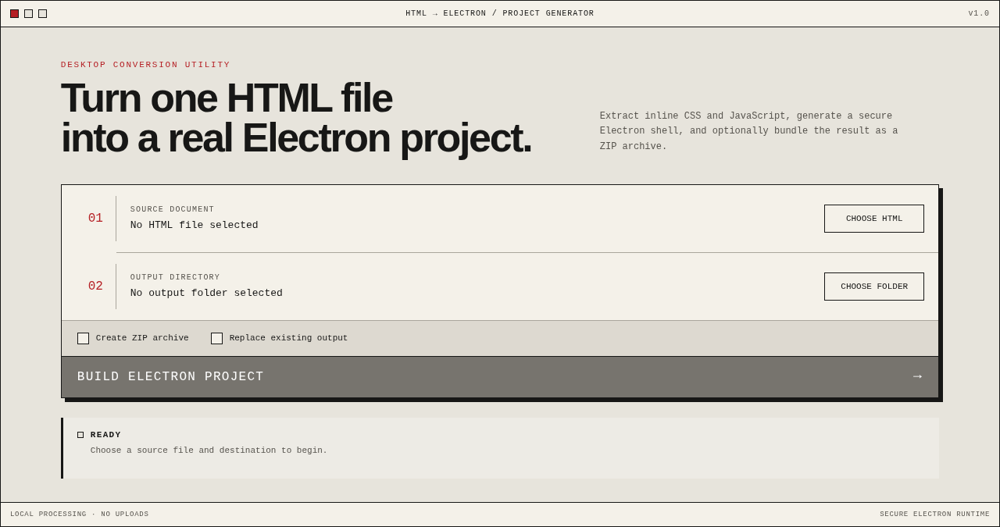

# HTML to Electron

Convert a self-contained HTML document into a secure, runnable Electron project from a desktop interface or the command line.



## What it does

- Extracts each inline `<style>` block into `style.css`, `style-2.css`, and so on while preserving its position and attributes
- Extracts each inline classic script into `renderer.js`, `renderer-2.js`, and so on without changing execution order
- Extracts inline module scripts into separate `renderer-module*.js` files so module scopes remain isolated
- Preserves external stylesheet and script references
- Generates a hardened Electron main process with context isolation, sandboxing, and Node integration disabled
- Creates a ready-to-run `package.json` and setup guide
- Optionally exports the generated project as a ZIP archive
- Refuses to overwrite a non-empty destination unless explicitly allowed

Everything is processed locally. The desktop interface does not upload source files.

## Requirements

- Node.js 22.12 or newer
- npm 10 or newer

## Install and run the desktop app

```bash
git clone https://github.com/numbpill3d/HTML-TO-ELECTRON.git
cd HTML-TO-ELECTRON
npm install
npm start
```

Choose an `.html` or `.htm` source file, select an output folder, and click **Build Electron Project**.

## Command line

```bash
node cli.js input.html
node cli.js input.html --output ./my-electron-app
node cli.js input.html --output ./my-electron-app --zip
node cli.js input.html --output ./my-electron-app --overwrite
```

Options:

| Option | Short | Description |
| --- | --- | --- |
| `--output <directory>` | `-o` | Choose the generated project directory |
| `--zip` | `-z` | Create a ZIP archive beside the output directory |
| `--overwrite` | | Replace a non-empty output directory |
| `--help` | `-h` | Show command help |
| `--version` | `-v` | Show the installed version |

You can also expose `html-to-electron` as a local command:

```bash
npm link
html-to-electron input.html -o ./desktop-app --zip
```

## Generated project

```text
my-electron-app/
├── index.html
├── style.css
├── style-2.css          # when multiple style blocks exist
├── renderer.js
├── renderer-2.js       # when multiple classic scripts exist
├── renderer-module.js  # when module scripts are present
├── main.js
├── package.json
└── README.md
```

Run the generated application:

```bash
cd my-electron-app
npm install
npm start
```

Build distributable packages:

```bash
npm run dist
```

## Input behavior and limitations

- Inline CSS and JavaScript are extracted; external `<link>` and `<script src>` elements remain unchanged.
- Relative external assets are not copied automatically. Copy those files into the generated project while preserving their relative paths.
- Inline JSON/import-map script blocks are preserved in the HTML rather than treated as executable JavaScript.
- Documents containing `<base href>` are rejected because it could redirect generated local assets to remote URLs.
- A strict Content Security Policy based on inline hashes may need to be updated for the generated external files.
- The converter does not rewrite application code that depends on browser-only APIs or a web server.
- Review generated applications before distributing them, especially when the input HTML comes from an untrusted source.

## Development

```bash
npm install
npm run check
npm run pack
```

`npm run check` runs the Node test suite and syntax checks. `npm run pack` creates an unpacked application for local verification.

## License

MIT — see [LICENSE](LICENSE).
